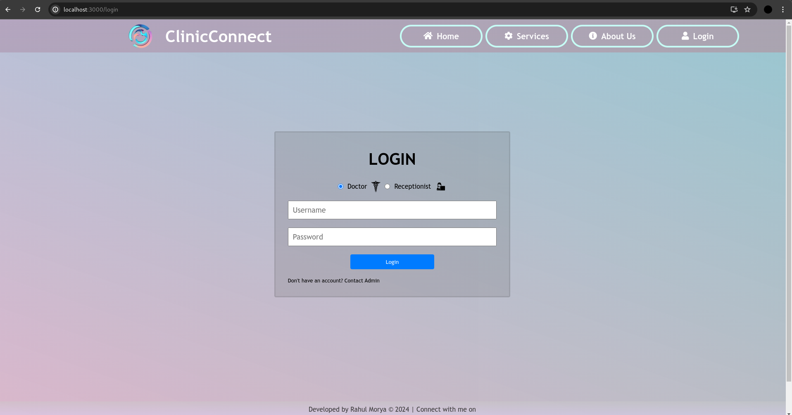
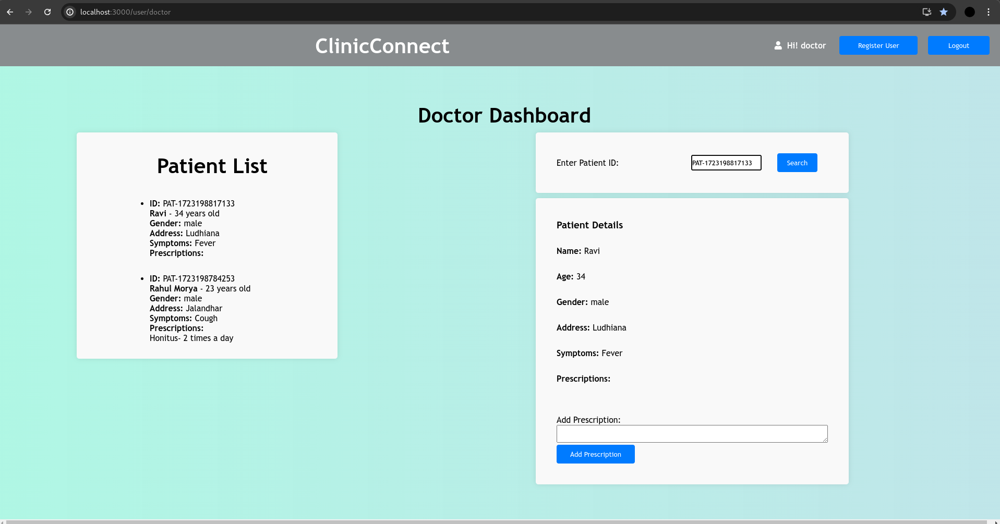
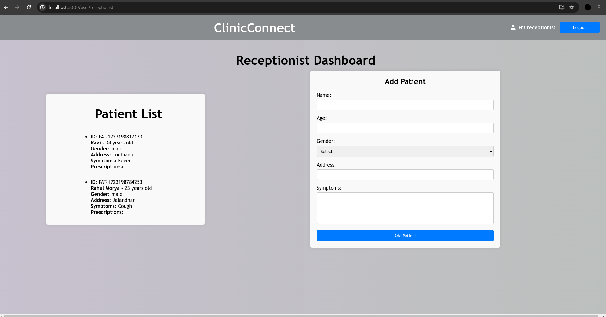
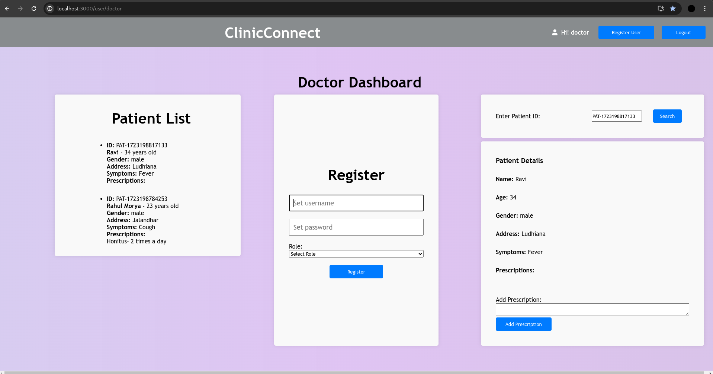
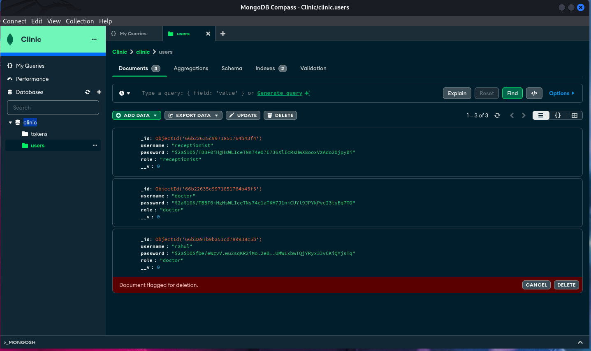
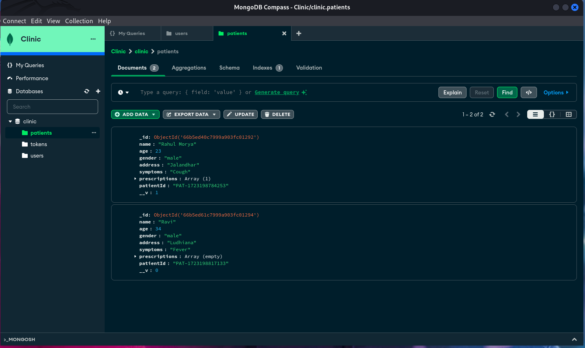

  
  

# ClinicConnect

ClinicConnect is a clinic management system built with React. It features a login system for doctors and receptionists, patient information management, token generation, and prescription handling.

The app provides an intuitive interface for managing a clinic's day-to-day operations.

**Deplyed on vercel** : https://clinic-connect.vercel.app/

## Features

- **Doctor Login**: Doctors can log in to the system and access patient details, add prescriptions, and view patient history.

- **Receptionist Login**: Receptionists can log in to the system, generate tokens for new patients, and create charges

- **Patient Information Management**: The system stores patient details including name, age, gender, address, symptoms, and prescriptions.

- **Token Generation**: Automatically generates a unique token/patient ID for new patients.

- **Prescription Management**: Doctors can add prescriptions to a patient's record.

- **404 Not Found Page**: A user-friendly 404 page is displayed when users try to access a non-existent route.

## Installation

### Prerequisites

- Node.js and npm

- MongoDB

  

1. **Clone the repository:**

```bash

git clone https://github.com/your-username/ClinicConnect.git

cd ClinicConnect

```

2.**Install dependencies:**

```bash

npm install
cd client
npm install
cd ..

```

3.**Set up environment variables**

Create a .env file in the root directory and add the following:

```env

MONGODB_URI=your_mongodb_uri

JWT_SECRET=your_jwt_secret

```

4.**Start the development server:**

```bash

npm start

```

  

The app will be available at http://localhost:3000

## API Endpoints

Create Patient: POST /api/patients

Get Patient: GET /api/patients/:patientId

Add Prescription: POST /api/patients/:patientId/prescription


## Technology Stack

- **Frontend**: React, React Router

- **Backend**: Node.js, Express

- **Database**: MongoDB

- **Authentication**: JWT (JSON Web Token)

- **Styling**: CSS


  ## Screenshots
  
   
   
   
   
   
   
